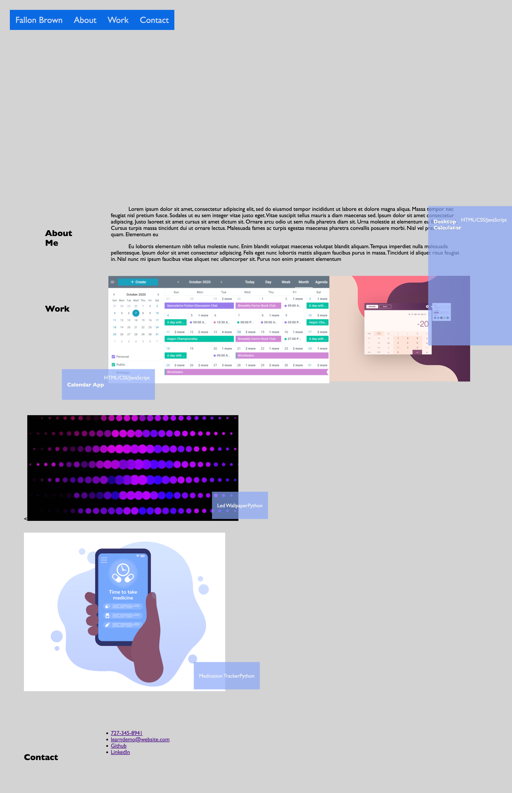

Website Porfolio Demo

## The purpose of this project is to create a demo website that satisfied the accpetance criteria. The following example is the work in progress of the demo site. 

##Screen shot 

## Code Sources
Assitance was used to create the starter HTML CSS code for the navigation. 

          <a  class="href="#fallon brown">Fallon Brown</a>
          <a href="#about">About</a>
          <a href="#work">Work</a>
          <a href="#Contact">Contact</a>

.topnav a {
  float: left;
  color: #f2f2f2d0;
  text-align: center;
  padding: 14px 16px;
  text-decoration: none;
  font-size: 25px;
}

.topnav a.split {
  float: right;
  background-color: lightblue;
  color: white
}
.topnav a:hover {
  background-color: rgb(135, 168, 250);
  color: whitesmoke
}
.txt-about-me{
  text-indent:50px;
  padding: 0%;

